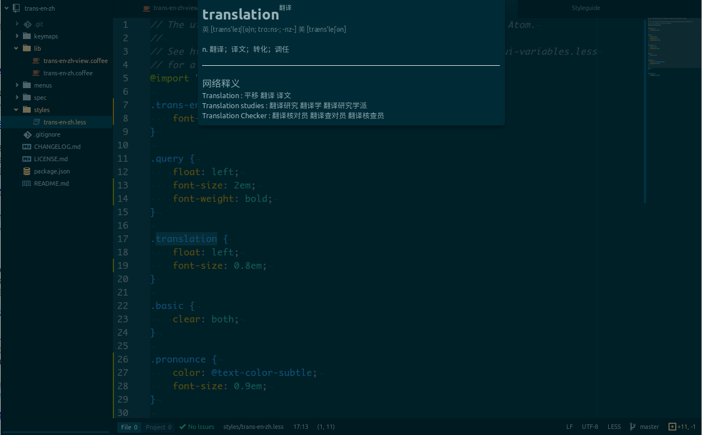

# trans-en-zh package

A simple way to lookup words.



### Installation

```
apm install trans-en-zh
```

### Key Bindings

*by default*
```cson
'atom-workspace':
  'F10': 'trans-en-zh:toggle'
```

### License

MIT
